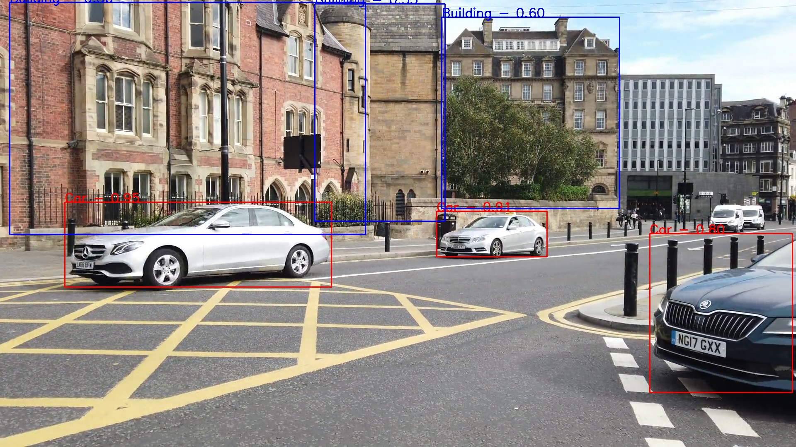
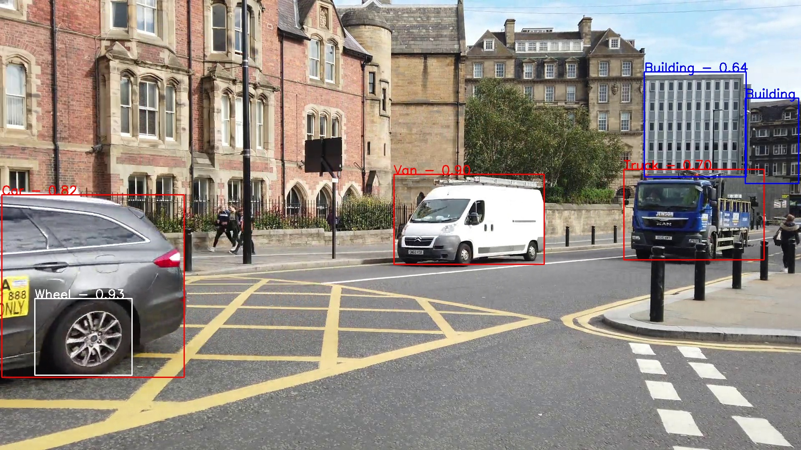
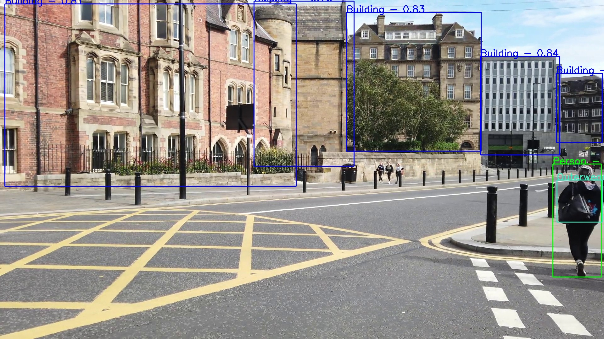

# Object detection in video

---

**Object detection in video**

 

In this Python project the [Google Cloud Vision API](https://cloud.google.com/vision/docs/libraries) is used to detect objects in a video. An annotated version of the video is returned.

Link to annotated video: https://www.youtube.com/watch?v=HLywAP-tRTU

---
### Files inculded

My project includes the following files:
* <code>main_annotate_video.py</code> - main script
* <code>image_annotator.py</code> - class for object detection and image annotation
* <code>video_transformer.py</code> - class that is used to turn a video into frames and vice versa

### Requirements

Python-Version: 3.7.2

Packeges:
* Numpy                 - numpy 
* OpenCV                - cv2
* Google Cloud          - google.cloud

### Usage

1. Set location for your [Google credentials](https://cloud.google.com/docs/authentication/getting-started) JSON-file in <code>main_annotate_video.py</code> (line 6)
2. Set parameters in <code>main_annotate_video.py</code> (line 7 to 11)
3. Run <code>main_annotate_video.py</code>

### Examples of annotated images

The annotation includes a bounding box, the label and the a certainty value. The certainty value ranges from 0 (uncertain) to 1 (certain) and is displayed next to the label. 

 

 

 

